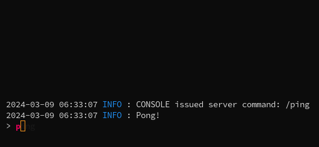

# MCSSH: Access your minecraft server via SSH (WIP)
> Using Paramiko and ServerTap WebSockets to access your Minecraft server via SSH

## Features
- Access your Minecraft server via SSH
- Send commands to the server
- Get the server log
- Autocomplete commands (still WIP)



## Requirements
- Python 3.10 or higher
- ServerTap API enabled on your Minecraft server
- A user with sudo permissions to restart the mcssh service

## Setup
### Clone the repository
```bash
git clone https://github.com/frederikbeimgraben/mcssh.git
cd mcssh
```

### Create virtual environment
```bash
python3 -m venv .env
source .env/bin/activate
```

### Install the requirements
```bash
pip install -r requirements.txt
```

### To test:
```bash
./mcssh
```

### Creating a systemd service
```bash
[Unit]
Description=MC-SSH Server
After=network.target

[Service]
Type=simple
User=<your-user>
WorkingDirectory=/path/to/mcssh

# Environment variables
Environment=MCSSH_SERVER=<your-minecraft-server-ip>
Environment=MCSSH_PORT=<your-servertap-port> # (default: 4567)

# Start the server
ExecStart=/path/to/mcssh/.env/bin/python /path/to/mcssh/server.py

# Restart the server
Restart=on-failure

[Install]
WantedBy=multi-user.target
```

> To be able to use the `reset` command your user should have NOPASSWD sudo permissions for the `systemctl restart mcssh.service` command.

## License
This project is licensed under the GPL-3.0 License - see the [LICENSE](LICENSE) file for details